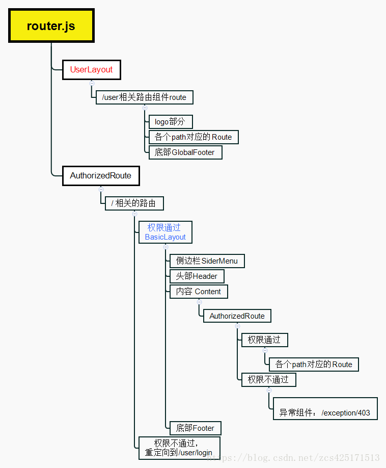

# StudyAntdPro
study-antd-design-pro

antd-pro脚手架生成[frontend](frontend)

## 整体页面观看
```
├── mock                     # 本地模拟数据
├── public
│   └── favicon.ico          # Favicon
├── src
│   ├── assets               # 本地静态资源
│   ├── common               # 应用公用配置，如导航信息
│   ├── components           # 业务通用组件
│   ├── e2e                  # 集成测试用例
│   ├── layouts              # 通用布局
│   ├── models               # dva model
│   ├── routes               # 业务页面入口和常用模板
│   ├── services             # 后台接口服务
│   ├── utils                # 工具库
│   ├── g2.js                # 可视化图形配置
│   ├── theme.js             # 主题配置
│   ├── index.ejs            # HTML 入口模板
│   ├── index.js             # 应用入口
│   ├── index.less           # 全局样式
│   └── router.js            # 路由入口
├── tests                    # 测试工具
├── README.md
└── package.json
```


布局组件MENU&&ROUTE

## [路由页面](frontend/src/common/router.js)
- 使用[path-to-regexp](https://www.npmjs.com/package/path-to-regexp)，我们可以在路径字符串中使用正则
```
const pathToRegexp = require('path-to-regexp')
var regexp_1 = pathToRegexp('/foo/:bar')// /^\/foo\/([^\/]+?)(?:\/)?$/i
regexp_1.exec('/foo/barrrr')//匹配成功 =>RegExpExecArray [ '/foo/barrrr', 'barrrr', index: 0, input: '/foo/barrrr' ]
regexp_1.exec('/bazzzz')//匹配失败 => null
```
- [React Loadable](https://www.npmjs.com/package/react-loadable)（以组件为中心的代码分割和懒加载）

- 动态切割路由

    - [future]( https://pro.ant.design/docs/deploy-cn#%E4%BB%A3%E7%A0%81%E5%88%86%E5%89%B2%E5%92%8C%E5%8A%A8%E6%80%81%E5%8A%A0%E8%BD%BD)
        &&[webback](https://webpack.docschina.org/guides/code-splitting/#%E5%8A%A8%E6%80%81%E5%AF%BC%E5%85%A5-dynamic-imports-)

    - [history]( https://pro.ant.design/docs/router-and-nav-cn#%E5%85%B3%E4%BA%8E-dynamicWrapper)

    - [question](https://github.com/ant-design/ant-design-pro/issues/1761)